# DataShield AI — Architecture Documentation

> Version 1.0 · Last updated 2026-03-27

---

## Table of Contents

1. [C1 — System Context](#c1--system-context)
2. [C2 — Container Diagram](#c2--container-diagram)
3. [C3 — Component Diagrams](#c3--component-diagrams)
4. [C4 — Code Level](#c4--code-level)

---

## C1 — System Context

**DataShield AI** is an agentic data privacy infrastructure that sits between AI agents and LLM APIs, intercepting data flows to detect PII/PHI/PCI entities, tokenize sensitive values, enforce compliance policies, and maintain a tamper-evident audit trail.

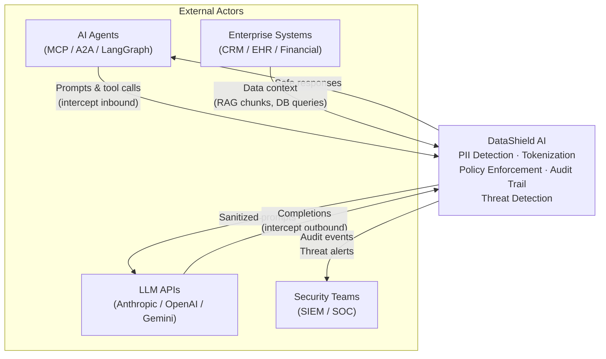

### Key Interactions

| Actor | Direction | Description |
|-------|-----------|-------------|
| AI Agents | Inbound | Submit text for scanning, protection, and restoration via REST API |
| LLM APIs | Outbound | Receive sanitized prompts after PII tokenization |
| Enterprise Systems | Inbound | Provide data context (RAG chunks, database records) for interception |
| Security Teams | Outbound | Receive audit events, threat alerts, and compliance reports |

### Security Boundary

- No AI API keys are stored server-side. The system operates on text payloads only.
- All vault mappings are session-scoped and ephemeral by default.
- Audit trail uses SHA-256 hash chaining for tamper evidence.

---

## C2 — Container Diagram

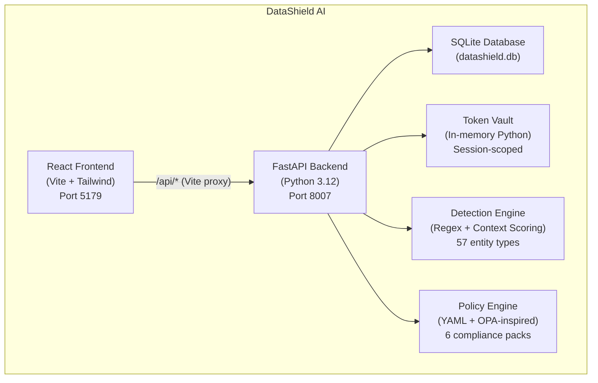

### Container Responsibilities

| Container | Technology | Responsibility |
|-----------|-----------|---------------|
| **Frontend SPA** | React 18, Vite, Tailwind CSS | 10 pages: Landing, Dashboard, Scanner, TokenVault, PolicyStudio, Interceptor, SemanticValidator, AuditTrail, Compliance, Settings |
| **API Server** | FastAPI, Python 3.12, Pydantic v2, aiosqlite | 9 routers + health endpoint, request validation, async database access |
| **SQLite Database** | aiosqlite, local file | 9 tables: scan_sessions, entities_detected, policies, audit_events, interceptor_logs, compliance_frameworks, compliance_controls, threat_events, settings, agent_roles |
| **Token Vault** | In-memory Python dataclasses | 6 obfuscation modes (REDACT, TOKENIZE, PSEUDONYMIZE, GENERALIZE, ENCRYPT, SYNTHESIZE), session lifecycle management |
| **Detection Engine** | Python regex, dataclasses, Enum | 4-stage pipeline: Regex matching, Context scoring, Validation (Luhn, etc.), Deduplication. 6 categories: PII, PHI, PCI, FINANCIAL, IP_CODE, CUSTOM |
| **Policy Engine** | PyYAML, dataclasses | YAML parsing, rule evaluation, conflict detection, compliance mapping, simulation |

---

## C3 — Component Diagrams

### C3a — Frontend Components

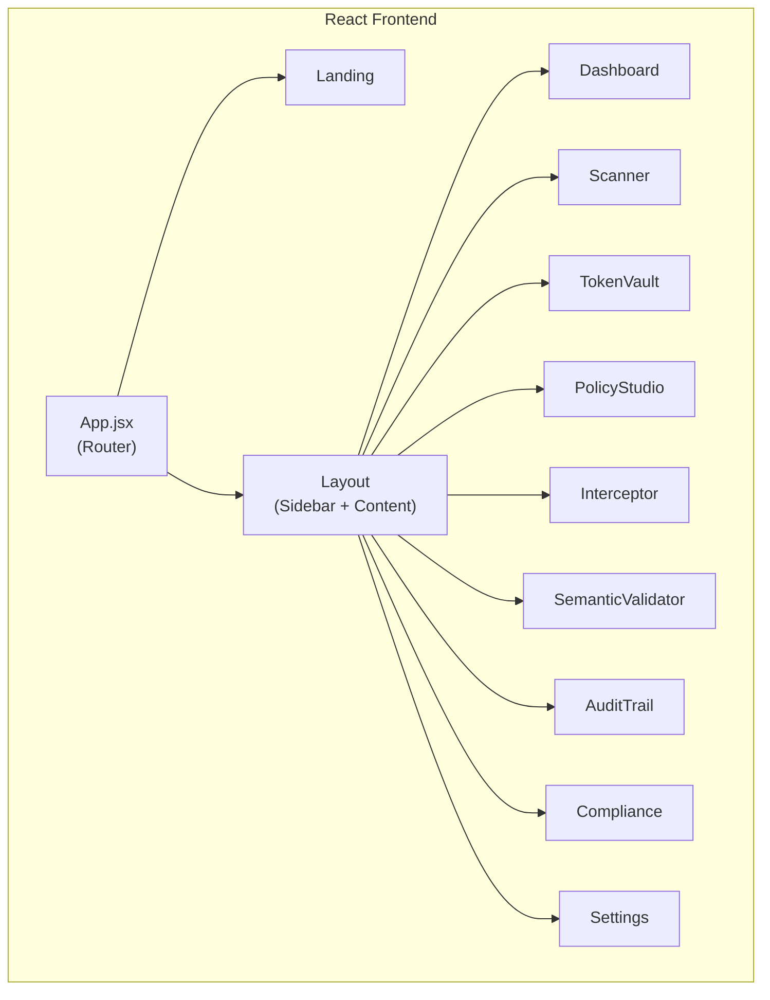

| Page | Responsibility |
|------|---------------|
| **Landing** | Product overview, feature highlights, CTA to dashboard |
| **Dashboard** | Aggregate stats: scans, entities protected, threats, compliance score, risk heatmap, timeline charts |
| **Scanner** | Text input with sample templates, real-time PII detection, entity annotation, batch scanning |
| **TokenVault** | Session management, entity-level token inspection, vault purge, session extend/expire |
| **PolicyStudio** | YAML policy editor, CRUD, compliance pack assignment, validation |
| **Interceptor** | Surface simulation (MCP, A2A, LLM_API, RAG), risk scoring, batch interception |
| **SemanticValidator** | Post-sanitization validation — verifies no PII remains in processed text |
| **AuditTrail** | Hash-chain viewer, event filtering, chain verification, export |
| **Compliance** | 8 framework dashboard, automated assessment, gap analysis, full report generation |
| **Settings** | Vault TTL, session timeout, confidence threshold, entity types toggle, notification config, agent role CRUD |

### C3b — Backend Components

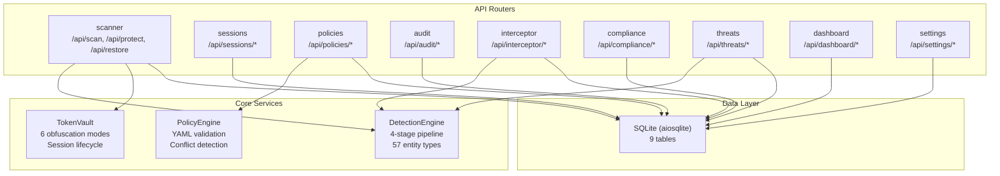

### Router Summary

| Router | Prefix | Endpoints | Core Responsibility |
|--------|--------|-----------|-------------------|
| scanner | `/api` | 7 | Scan, protect (tokenize), restore, batch scan, validate, entity registry, samples |
| sessions | `/api/sessions` | 6 | Session CRUD, entity listing, audit trail per session, extend, purge |
| policies | `/api/policies` | 4 | Policy CRUD with YAML validation |
| audit | `/api/audit` | 7 | Event listing, detail, stats, hash-chain verification, export, agent summary, session trail |
| interceptor | `/api/interceptor` | 5 | Logs, simulation, batch simulation, stats, surface metadata |
| compliance | `/api/compliance` | 6 | Frameworks, summary, gaps, report, framework detail, automated assessment |
| threats | `/api/threats` | 6 | Threat listing, simulation, stats, patterns, detail, resolve |
| dashboard | `/api/dashboard` | 7 | Stats, timeline, entity distribution, threat summary, agent activity, top entities, surface activity, risk heatmap |
| settings | `/api/settings` | 5 | Settings GET/PUT, agent role CRUD (list, create, delete) |

---

## C4 — Code Level

### C4a — Detection Engine Pipeline

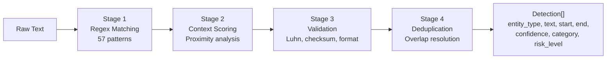

**Key Data Structures:**

```python
class Category(str, Enum):
    PII = "PII"          # SSN, EMAIL, PHONE, PERSON_NAME, IP_ADDRESS, PASSPORT, DRIVERS_LICENSE
    PHI = "PHI"          # DATE (medical context)
    PCI = "PCI"          # CREDIT_CARD
    FINANCIAL = "FINANCIAL"  # IBAN
    IP_CODE = "IP_CODE"  # API_KEY
    CUSTOM = "CUSTOM"

class RiskLevel(str, Enum):
    CRITICAL = "CRITICAL"  # SSN, CREDIT_CARD, IBAN, API_KEY, PASSPORT, DRIVERS_LICENSE
    HIGH = "HIGH"          # EMAIL, PHONE, PERSON_NAME
    MEDIUM = "MEDIUM"      # IP_ADDRESS, DATE
    LOW = "LOW"
```

**Entity-to-Regulation Mapping (11 core types):**

| Entity Type | Category | Risk Level | Regulatory Basis | Default Action |
|-------------|----------|-----------|-----------------|----------------|
| SSN | PII | CRITICAL | GDPR Art.87, CCPA, HIPAA | REDACT |
| EMAIL | PII | HIGH | GDPR Art.4(1), CCPA 1798.140(o) | TOKENIZE |
| PHONE | PII | HIGH | GDPR Art.4(1), CCPA | TOKENIZE |
| CREDIT_CARD | PCI | CRITICAL | PCI DSS Req.3, GDPR Art.4(1) | REDACT |
| IP_ADDRESS | PII | MEDIUM | GDPR Rec.30, CCPA 1798.140(o) | MASK |
| PERSON_NAME | PII | HIGH | GDPR Art.4(1), HIPAA 164.514 | TOKENIZE |
| IBAN | FINANCIAL | CRITICAL | PCI DSS, GDPR Art.4(1), SOX | REDACT |
| API_KEY | IP_CODE | CRITICAL | SOX Section 302, Internal Policy | REDACT |
| DATE | PHI | MEDIUM | HIPAA 164.514(b)(2)(i) | GENERALIZE |
| PASSPORT | PII | CRITICAL | GDPR Art.87, CCPA | REDACT |
| DRIVERS_LICENSE | PII | CRITICAL | GDPR Art.87, CCPA, HIPAA | REDACT |

### C4b — Token Vault Lifecycle

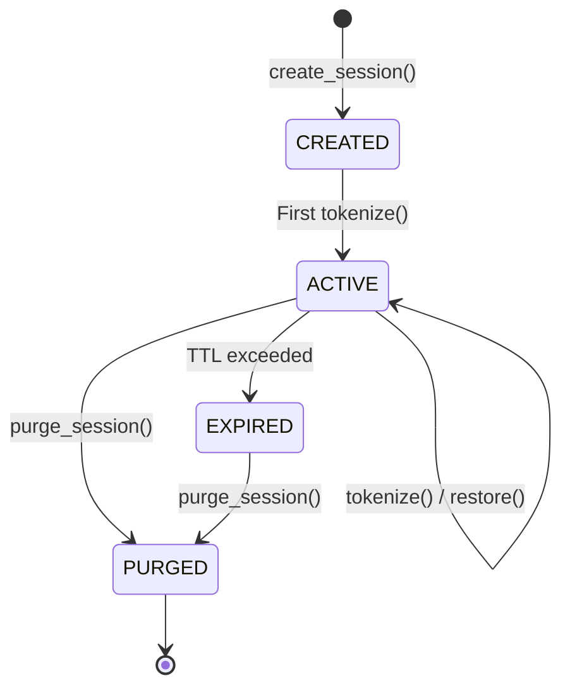

**6 Obfuscation Modes:**

| Mode | Behavior | Reversible |
|------|----------|-----------|
| REDACT | Replace with `[REDACTED]` | No |
| TOKENIZE | Replace with vault token `<<TYPE_uuid>>` | Yes |
| PSEUDONYMIZE | Replace with consistent fake value | Yes (via vault) |
| GENERALIZE | Replace with category label (e.g., date -> "2020s") | Partial |
| ENCRYPT | Base64 + hash-based obfuscation | Yes (via vault) |
| SYNTHESIZE | Generate synthetic replacement value | No |

### C4c — Policy Engine Evaluation

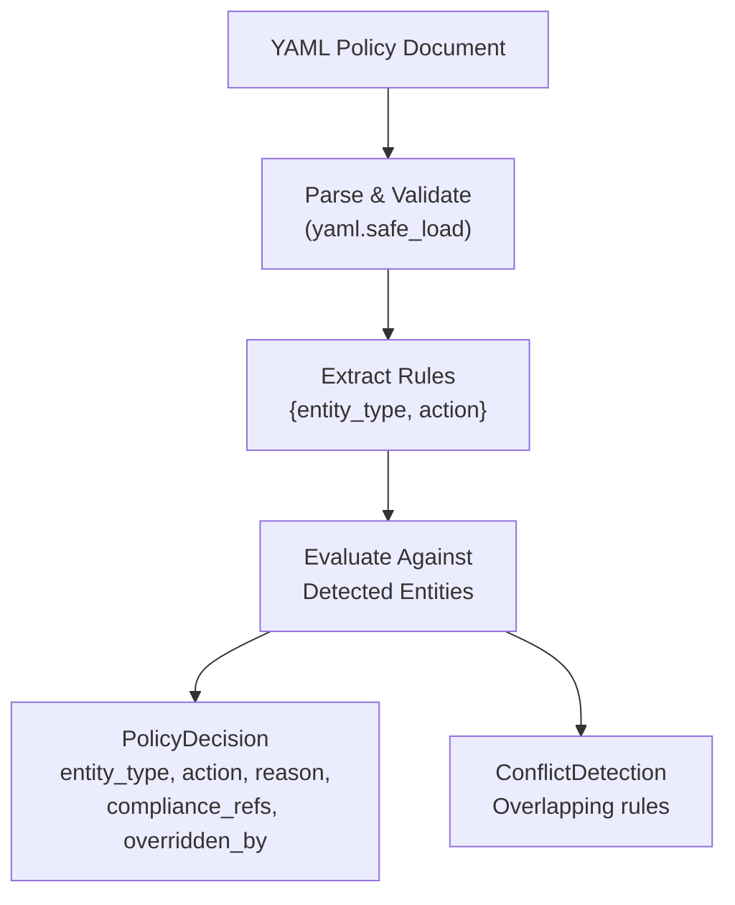

**Policy Decision Actions:** REDACT, TOKENIZE, PSEUDONYMIZE, GENERALIZE, ENCRYPT, SYNTHESIZE, MASK, PASS, BLOCK

### C4d — Threat Detection

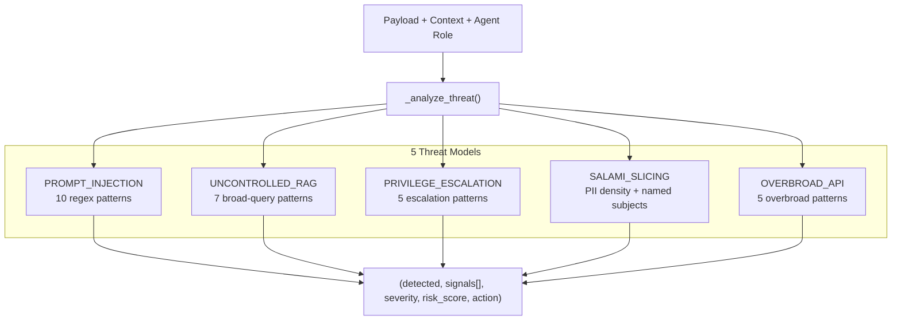

### C4e — Audit Hash Chain

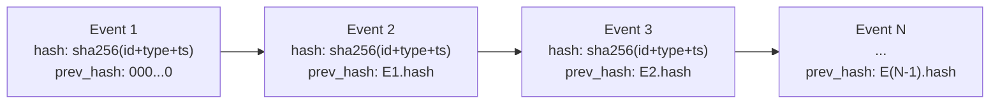

The `/api/audit/verify` endpoint walks the entire chain and reports any broken links where `event[i].prev_hash != event[i-1].hash`.

### C4f — Interception Surfaces

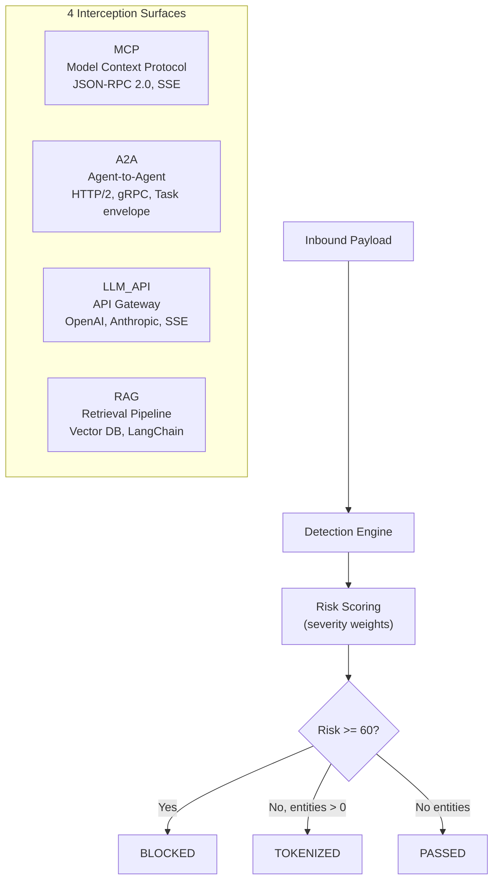

**Risk Scoring Weights:**

| Entity Type | Weight |
|-------------|--------|
| API_KEY | 30 |
| SSN, CREDIT_CARD | 25 |
| IBAN, PASSPORT | 20 |
| DRIVERS_LICENSE | 18 |
| EMAIL, PHONE | 8 |
| PERSON_NAME | 6 |
| IP_ADDRESS | 5 |
| DATE | 3 |

---

## Database Schema

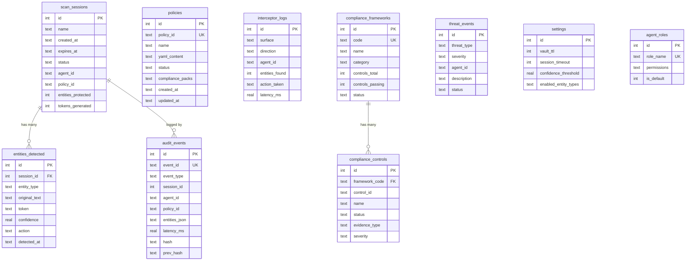
