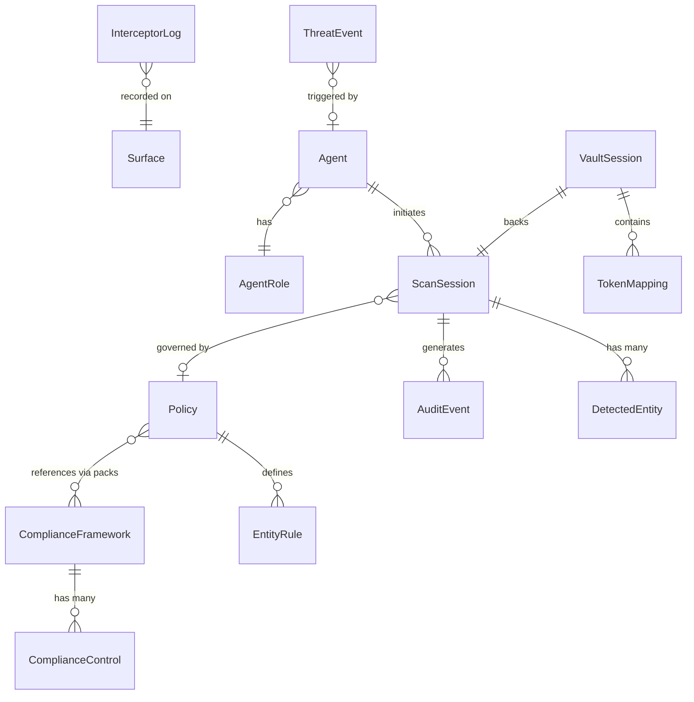

# DataShield AI — Domain Model

> Version 1.0 · Last updated 2026-03-27

---

## Entity Relationship Diagram

---

## Aggregate Roots

### ScanSession

The central unit of work. A scan session is created when text is scanned or protected, and it tracks all detected entities, tokenization actions, and audit events within that scope.

| Attribute | Type | Description |
|-----------|------|-------------|
| id | Integer | Auto-increment primary key |
| name | String | Human-readable session label |
| status | Enum | ACTIVE, EXPIRED, PURGED |
| agent_id | String | Identifier of the AI agent that initiated the session |
| policy_id | String | Policy applied during this session |
| entities_protected | Integer | Count of entities tokenized/redacted |
| tokens_generated | Integer | Count of vault tokens created |
| created_at | ISO DateTime | Session creation timestamp |
| expires_at | ISO DateTime | Session TTL expiration |

### Policy

Declarative YAML-based rules that determine how each entity type should be handled. Policies are versioned, validated on write, and linked to compliance packs.

| Attribute | Type | Description |
|-----------|------|-------------|
| policy_id | String (unique) | Stable identifier for GitOps workflows |
| name | String | Display name |
| yaml_content | Text | Full YAML policy document |
| status | Enum | DRAFT, ACTIVE, ARCHIVED |
| compliance_packs | JSON Array | List of framework codes (e.g., ["GDPR", "HIPAA"]) |

### ComplianceFramework

Represents a regulatory or industry standard against which the system is assessed.

| Attribute | Type | Description |
|-----------|------|-------------|
| code | String (unique) | Framework identifier (e.g., GDPR, HIPAA, PCI-DSS-4) |
| category | String | Grouping (Privacy, Financial, Healthcare, etc.) |
| controls_total | Integer | Number of controls in this framework |
| controls_passing | Integer | Controls currently passing assessment |
| status | Enum | COMPLIANT, PARTIAL, NON_COMPLIANT, NOT_ASSESSED |

---

## Value Objects

### DetectedEntity

An individual PII/PHI/PCI entity found within a scan session.

| Attribute | Type | Description |
|-----------|------|-------------|
| entity_type | String | SSN, EMAIL, PHONE, CREDIT_CARD, etc. |
| original_text | String | The matched text fragment |
| token | String | Vault token replacement (if tokenized) |
| confidence | Float (0-1) | Detection confidence score |
| action | String | DETECTED, TOKENIZE, REDACT, MASK, etc. |

### AuditEvent

An immutable, hash-chained record of a system action.

| Attribute | Type | Description |
|-----------|------|-------------|
| event_id | String (unique) | `evt_<hex10>` format |
| event_type | String | SCAN, PROTECT, RESTORE, SESSION_EXTEND, SESSION_PURGE, etc. |
| hash | SHA-256 | Hash of this event's content |
| prev_hash | SHA-256 | Hash of the preceding event (chain link) |
| entities_json | JSON | Contextual entity data for this event |
| latency_ms | Float | Processing time in milliseconds |

### ThreatEvent

A detected or simulated threat against the system.

| Attribute | Type | Description |
|-----------|------|-------------|
| threat_type | Enum | PROMPT_INJECTION, UNCONTROLLED_RAG, PRIVILEGE_ESCALATION, SALAMI_SLICING, OVERBROAD_API |
| severity | Enum | CRITICAL, HIGH, MEDIUM, LOW |
| detection_signal | String | Concatenated signals that triggered detection |
| response_action | String | Action taken (block, flag, log) |
| status | Enum | BLOCKED, FLAGGED, PASSED, RESOLVED |

### InterceptorLog

A record of payload interception at a specific surface.

| Attribute | Type | Description |
|-----------|------|-------------|
| surface | Enum | MCP, A2A, LLM_API, RAG |
| direction | Enum | INBOUND, OUTBOUND |
| entities_found | Integer | Count of entities detected in payload |
| action_taken | Enum | BLOCKED, TOKENIZED, PASSED, LOGGED |
| latency_ms | Float | Interception processing time |

### TokenMapping (In-Memory)

A vault entry mapping original text to its obfuscated replacement.

| Attribute | Type | Description |
|-----------|------|-------------|
| vault_ref | String | Unique vault reference identifier |
| original_text | String | The original sensitive text |
| obfuscated_text | String | The replacement text |
| mode | ObfuscationMode | REDACT, TOKENIZE, PSEUDONYMIZE, GENERALIZE, ENCRYPT, SYNTHESIZE |
| entity_type | String | Type of detected entity |

---

## Domain Glossary

| Term | Definition |
|------|-----------|
| **Entity Type** | A classification of sensitive data (e.g., SSN, EMAIL, CREDIT_CARD). The detection engine recognizes 57 types across 6 categories. |
| **Obfuscation Mode** | The method used to protect a detected entity. Six modes: REDACT (irreversible removal), TOKENIZE (reversible vault token), PSEUDONYMIZE (consistent fake value), GENERALIZE (category replacement), ENCRYPT (hash-based encoding), SYNTHESIZE (generate synthetic data). |
| **Vault Reference** | A unique identifier (`vault://<hex12>`) that maps to a set of token mappings within a session. Used to restore original text via the `/api/restore` endpoint. |
| **Session Scope** | The lifecycle boundary for tokenization. All vault mappings are tied to a session. When a session is purged, all mappings are destroyed. Sessions have a configurable TTL (default: 1800s). |
| **Compliance Pack** | A named set of regulatory requirements (e.g., GDPR, HIPAA, PCI-DSS-4) that a policy can reference. Each pack maps to a ComplianceFramework with specific controls. |
| **Threat Model** | One of 5 agentic threat patterns: Prompt Injection, Uncontrolled RAG, Privilege Escalation, Salami Slicing, Overbroad API. Each has defined detection signals, severity thresholds, and response actions. |
| **Interception Surface** | A protocol boundary where DataShield inspects data flows. Four surfaces: MCP (tool calls), A2A (inter-agent), LLM_API (prompt/completion), RAG (retrieval chunks). |
| **Hash Chain** | A tamper-evident audit trail where each event's `hash` is computed from its content and the `prev_hash` links to the preceding event. Verification walks the chain to detect breaks. |
| **Risk Score** | A 0-100 numeric score computed from entity severity weights during interception. Payloads scoring >= 60 are blocked. |
| **Confidence Threshold** | A configurable minimum confidence (default: 0.75) below which detections are discarded. Managed via Settings. |
| **Agent Role** | A named permission set (e.g., read-only, analyst, admin) assigned to AI agents. Low-privilege roles trigger additional threat signals during interception. |
